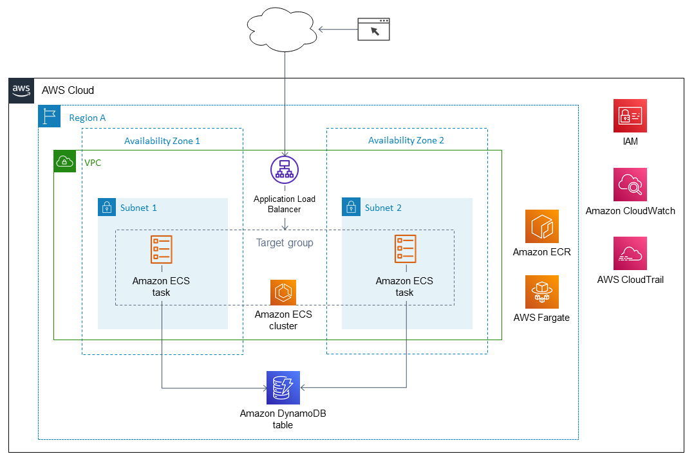

```markdown
# 🚀 Full-Stack 3-tier ECS AWS Infrastructure with Terraform

This Terraform project provisions a scalable AWS infrastructure including:

- 🐳 ECS (Fargate) to run containerized applications  
- 📦 ECR for storing Docker images  
- 🌐 Route 53 for DNS and domain routing  
- 🔐 ACM for HTTPS with SSL certificates  
- 🛢️ RDS PostgreSQL database for persistent storage  
- 🪣 S3 for static assets  
- 🌍 CloudFront for fast, global content delivery
```

## High Lavel Diagram:

---

## 🧱 Components

| Service      | Purpose                                |
|--------------|----------------------------------------|
| **ECS**      | Hosts your application using Fargate   |
| **ECR**      | Stores Docker images                   |
| **RDS**      | Manages PostgreSQL database            |
| **S3**       | Serves static files (e.g. images)      |
| **CloudFront** | CDN for S3 and secure app delivery   |
| **ACM**      | Provides SSL certificates (HTTPS)      |
| **Route 53** | Manages DNS records                    |

---

---

## ⚙️ Prerequisites

- [Terraform](https://www.terraform.io/downloads.html) ≥ 1.0
- AWS CLI with credentials configured
- A registered domain in Route 53
- Docker (for building and pushing to ECR)

---

## 🚀 Getting Started

### Initialize Terraform

```bash
cd environments/dev
terraform init
```

### Plan and Apply

```bash
terraform plan
terraform apply
```

---

## 🔄 Deployment Workflow

1. **Push Docker Image to ECR**

```bash
aws ecr get-login-password --region us-east-1 | docker login --username AWS --password-stdin <ecr_repo_url>
docker build -t my-app .
docker tag my-app:latest <ecr_repo_url>:latest
docker push <ecr_repo_url>:latest
```

2. **Deploy ECS Task (if manual update is needed)**
   (Or use CI/CD tools like GitHub Actions, Jenkins)

---

## 🔐 Security

* RDS credentials are stored securely (e.g., via AWS Secrets Manager if integrated)
* IAM roles are scoped to the minimum privileges required
* CloudFront and ACM handle HTTPS encryption

---

## 🌐 Access

* **App URL:** `https://app.example.com`
* **Static Assets (S3 + CloudFront):** `https://static.example.com`

---

## 🧹 Cleanup

```bash
terraform destroy
```

---

## 🙋‍♂️ Author

**Nusrat**
GitHub: [opswithnusrat](https://github.com/opswithnusrat)

---